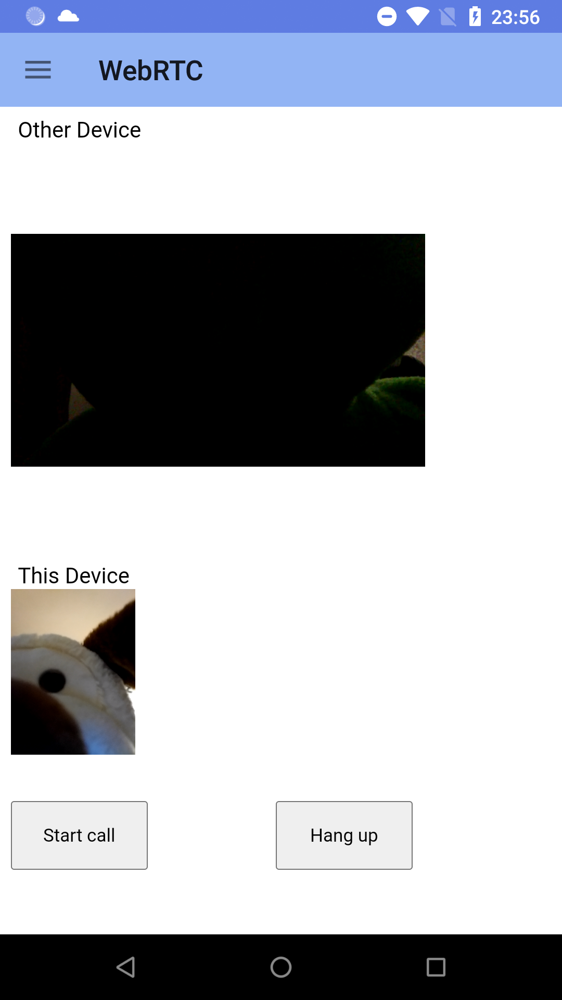

# WebRtcWebView
Android application for video and audio communication with WebRTC with a WebView

To perform a video connection you need to run the signalling server application on a computer and the Android application on two Android devices and or on an Android device and access the web app on the computer which is running the signalling server application.
All devices have to be on the same local network.
In the videochat.js file you need to add the IP address of the signalling server.
In the "Local Video" section you can test if you have access to the local video and audio devices.

Application screenshot: 

Videos: 
<a href="https://youtube.com/shorts/rvfvUFZykEc?feature=share">Video 1<a/> 
<a href="https://youtube.com/shorts/iH1XyszlsqA?feature=share">Video 2<a/> 

Started from this tutorial:
<a href="https://itsallbinary.com/create-your-own-video-conference-web-application-using-java-javascript/">https://itsallbinary.com/create-your-own-video-conference-web-application-using-java-javascript/</a>

Using the signalling Server from:
<a href="https://github.com/itsallbinary/video-conf-tutorial">https://github.com/itsallbinary/video-conf-tutorial</a>